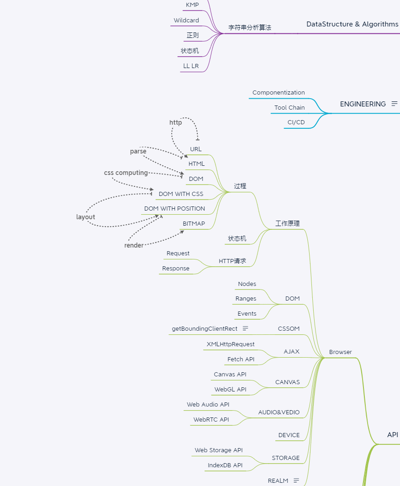

学习笔记
===============================================
## 脑图&知识梳理
根据课程进度逐步把脑图进一步完善

## HTTP
   HTTP协议是一个文本型协议，与二进制协议相对，内容全是字符串，使用Unicode || ASCII编码
## REQUEST & RESPONSE格式
### REQUEST
    * POST/HTTP/1.1                                     -- request line (methods path 协议/版本号)
    * Host: 127.0.0.1                                   -- headers
    * Content-Type: application/x-www-from-urlencoded   -- headers
    *                                                   -- space line
    * field1=aaa&code=x#3D1
### RESPONSE
    * HTTP/1,1 200 OK                                   -- status line (协议/版本号 http状态码 http状态文本)
    * Content-Type: text/html                           -- headers
    * Date: Mon,23 Dec 2019 06:46:19 GMT                -- headers
    * Connection: keep-alive                            -- headers
    * Transfer-Encoding: chunked                        -- headers
    *                                                   -- space line
    * 26                                                -- body (格式由Content-Type决定)
    * <html><body>body content<body><html>              -- body (node默认返回的body格式是chunked body => 16进制的数字开头单独一行，以16进制的0结尾单独一行)
    * 0                                                 -- body             
## 浏览器工作原理
1. HTTP请求
    - 设计一个HTTP请求的类
    - content type 是一个必要字段，要有默认值
    - body是KV格式
    - 不同的content-type影响body的格式
2. send函数编写
    - Request构造器中收集必要的信息
    - 设计一个send函数，把请求真实的发送到服务器
    - send函数应该是异步的
3. send发送请求共分三步
    - 设计支持已有的connection或者自己新建connection
    - 收到的数据传给parser
    - 根据parser的状态resolve Promise
4. ResponseParser
    - Response必须分段构造，所以我们要用一个ResponseParser来"装配"
    - ResponseParser分段主力ResponseText, 我们用状态机来分析文本的结构
5. BodyParser
    - Response的body可能根据Content-Type有不同的结构，因此我们会采用子Parser的结构来解决问题
    - 以TrunkedBodyParser为例，使用状态及来处理body的格式