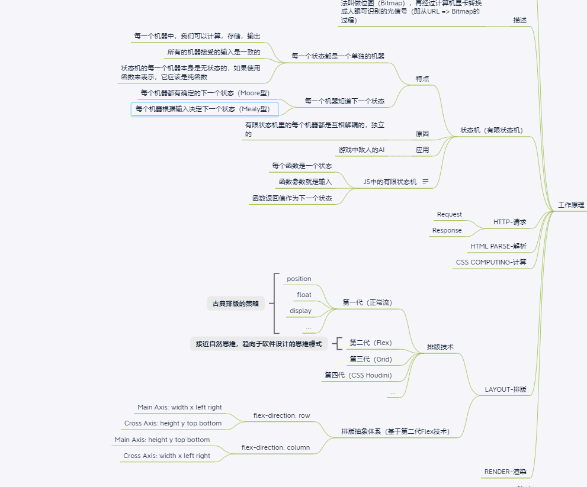

学习笔记
===============================================
## 脑图&知识梳理
   根据课程进度逐步把脑图进一步完善
   
## layout排版
1. 第一步-准备工作:
    - 处理掉flexDirection 和 wrap相关的属性
    - 把具体的height，width等属性抽象成了main，cross相关的属性
2. 第二步-收集元素进行:
    - 根据主轴尺寸，把元素进行分行
    - 若设置了no-wrap，强行分配进第一行
3. 第三步-计算主轴方向:
    - 找出所有Flex元素
    - 把主轴方向的剩余尺寸按比例分配给这些元素
    - 若剩余空间为负数，所有flex元素为0，等比压缩剩余元素
4. 第四步-计算交叉轴方向:
    - 根据每一行中最大元素尺寸计算行高
    - 根据行高flex-align 和 item-align，确定元素具体位置
## render绘制
1. 第一步-单元素的绘制
    - 需要依赖图形环境
    - 这里采用的npm的images包
    - 绘制在viewport上进行的
    - 与绘制相关的属性： background-color， border， background-image
2. 第二步-DOM树的绘制
    - 需要递归调用子元素的绘制方法完成DOM树的绘制
    - 忽略一些不需要绘制的节点
    - 实际浏览器中，文字绘制较难，需要依赖字体库
    - 实际浏览器中还会对一些图层做compositing