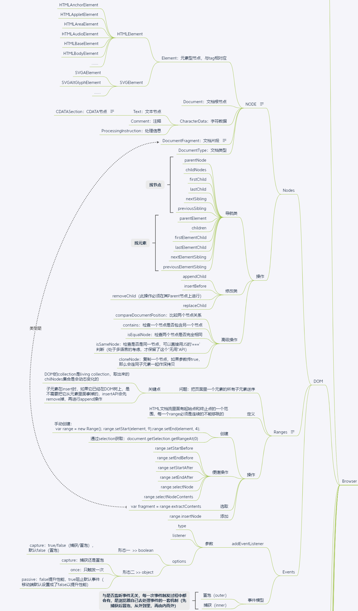
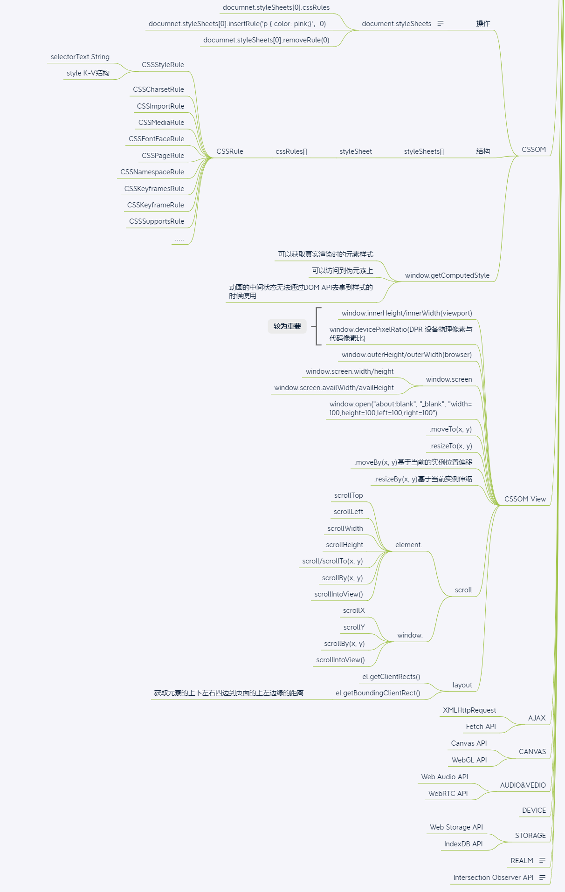
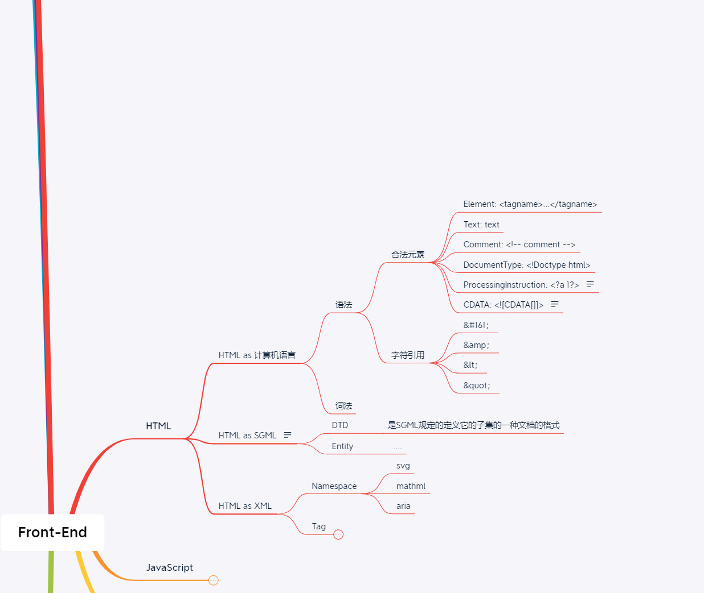

# 学习笔记

## 1.归类并完善脑图

根据课程进度逐步把脑图进一步完善




## 2.HTML 标签语义

- `<hr>`使用的场景是切换话题或者改变故事走向
- em 与 strong 标签区别 em 对于单个句子有语气强调的作用 strong 是整文或整段强调
- dfn 词语定义
- samp 标签表示例子
- 代码内容使用 code 标签
- footer 不一定是放在 body 下，也可以放到 article 里面

## 3.DOM API

- 把 element 的 childNodes 变成一个普通的数组之后，它就没有 living collection 特性了，也不会再随着 DOM 的 insert remove 等操作变化
- 在元素前后添加元素

```
box.parentNode.insertBefore(p, box); // 在box之前添加元素
box.parentNode.insertBefore(p, box.nextSibling); // 在box之后添加元素
```

## 4.Rect

- 伪元素本身也会参与到盒的生成过程中
- 伪元素在页面上是无法被选中以及相关 copy 操作的
