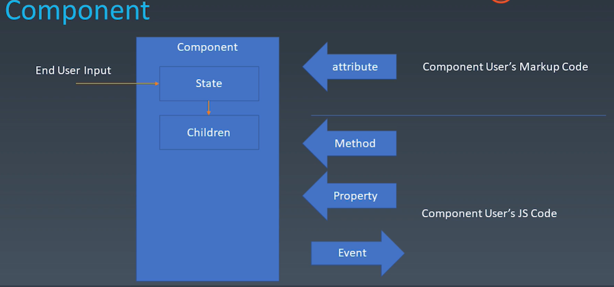

# 学习笔记

## 1.归类并完善脑图

根据课程进度逐步把脑图进一步完善

## 2.对象与组件

### 对象

- Properties 属性(javascript 里面的属性与方法是一体的)
- Methods 方法
- Inherit 继承关系 (javascript 默认采用的是原型继承)

### 组件

- Properties(属性)
- Methods
- Inherit
- Attribute(特性)
- Config & State(Config 构造函数中传入的初始化配置, State 是随着用户的行为发生变化的内部状态)
- Event(事件机制)
- Lifecycle
- Children(树形结构的必要性)


JSX 可以被理解为通过 attribute 来影响组件

#### Attribute vs Property

1. Attribute 强调描述性，Property 强调从属关系

2. 写法与特殊场景

Attribute:

```
<myComponent attribute="v" />
myComponnet.getAttribute("a")
myComponnet.setAttribute("a", "value")
```

Property:

```
myComponnet.a = "value"
```

早年的 js 里 calss 是关键字，HTML 的 attribute 在 class 问题上做了妥协，attribute 仍然叫做 class，而 property 变成了 calssName，两者之间是完全的互相反射关系，HTML 仍然不支持 class 这个名字

3. 有时 Attribute 是字符串，Property 是字符串语义化之后的对象，例如 style

4. 有时 Property 是经过 resolve 后的 URL，Attribute 是纯字符串

```
<a href="//m.taobao.com"></a>

var a = document.getElementByTagName('a')
a.href // 'http://m.taobao.com'
a.getAttribute('href') // '//m.taobao.com'
```

5. input 的 value

```
<input value="cute" />

var input = document.getElementByTagName('input') // 若property没有设置，则结果是attribute
input.value // cute
input.getAttribute('value') // cute
input.value = 'hello' // 若value属性已经设置，则attribute不变，property变化，元素上实际的效果是property优先
input.value // hello
input.getAttribute('value') // cute
```

input 的 value，Attribute 是相当于一个默认值

#### 如何设计组件状态

| markuo set | JS set | JS Change | User Input Change | -         |
| ---------- | ------ | --------- | ----------------- | --------- |
| x          | ok     | ok        | 一般不会改变      | property  |
| x          | ok     | ok        | 一般不会改变      | attribute |
| x          | x      | x         | ok                | state     |
| x          | ok     | x         | x                 | config    |

#### Lifecycle

```flow
st=>start:created
op1=>operation: mounted
op2=>operation: JS change/set
op3=>operation: User Input
e=>end: destroyed
```

created 和 destroyed 这两个生命周期一定有

#### Children

有两种类型的 Children:

- Content 型 Children(有几个 Child 就显示出来几个 Child，所写即所见)
- Template 型 Children(充当了一个模板的作用，最终的组件数目是根据数据生成的)

### JSX

#### JSX 环境安装

JSX 纯粹相当于在语法上的一种快捷方式

1. 新建目录

```
makedir XXX && cd XXX
```

2. 初始化文件目录

```
npm init
```

3. 全局安装 webpack webpack-cli

```
npm i -g webapck weback-cli
```

4. 本地安装 webpack babel-loader(babel-loader 实际上是 webpack 的一个 loader，babel-loader 无法单独使用，所以需要安装 babel)

```
npm i --save-dev webpack babel-loader
```

5. 创建 webpack 配置文件 & 添加入口文件

- 新建 webpack.config.js

```
module.exports = {
    entry: "./main.js"
}

```

- 新建 main.js

6. 安装 babel/core 和 bable/preset-env(因为 babel 要求与 webpack 独立安装)

```
npm i --save-dev @babel/core @babel/preset-env
```

7. 配置 babel-loader

```
module.exports = {
    entry: "./main.js",
    module: {
        rules: [
            {
                test: /\.js$/,
                use: {
                    loader: "babel-loader",
                    options: {
                        presets: ["@babel/preset-env"]
                    }
                }
            }
        ]
    }
}
```

7. 引入 & 配置 jsx

```
npm i --save-dev @babel/plugin-transform-react-jsx
```

```
module.exports = {
    entry: "./main.js",
    module: {
        rules: [
            {
                test: /\.js$/,
                use: {
                    loader: "babel-loader",
                    options: {
                        presets: ["@babel/preset-env"],
                        plugins: ["@babel/plugin-transform-react-jsx"]
                    }
                }
            }
        ]
    },
    mode: "development" // 发布时改成production
}
```

#### JSX 的基本使用方法

1. 修改 plugin 参数

```
...
loader: "babel-loader",
options: {
    presets: ["@babel/preset-env"],
    plugins: [["@babel/plugin-transform-react-jsx", { pragma: "createElement" }]]
}
...
```

2. 定义 createElement 函数

```
function createElement () {
    return
}
```

3. JSX 传参

- 查看 JSX 打包后实际代码
  当 JSX 的 TAG 没有属性时打包结果是:

```
var a = createElement("div", null)
```

当 JSX 的 TAG 有属性时，属性-值作为第二个参数以包含 K-V 的形式的对象传参:

```
var a = createElement("div", {
    id: "a"
})
```

- => JSX 只是把函数调用用一种看起来像 HTML 的形式，类似于一种语法糖，但是它会改变代码结构

当 JSX 的 TAG 有 children 时:
JSX:

```
let a = <div id="123">
        <span></span>
        <span></span>
        <span></span>
    </div>
```

打包后:

```
var a = createElement("div", {
    id: "123"
  },
  createElement("span", null),
  createElement("span", null),
  createElement("span", null)
);
```

- => JSX 的 children 作为函数的第三到 N 个参数传入，参数内容为递归调用函数自身
- => 推导出 createElement 函数参数接收方式

```
function createElement (type, sttributes, ...children) {
    return;
}
```

- => 可以在 createElement 函数中构造并返回一个实际的 DOM 节点

```
function createElement (type, attributes, ...children) {
    let element = document.createElement(type)
    for (let attrName in attributes) {
        element.setAttribute(attrName, attributes[attrName])
    }
    for (child of children) {
        element.appendChild(child)
    }
    return element
}

let a = <div id="123">
        <span></span>
        <span></span>
        <span></span>
    </div>

document.body.appendChild(a)
```

- => 用 createTextNode 来处理文本节点

```
function createElement (type, attributes, ...children) {
    let element = document.createElement(type)
    for (let attrName in attributes) {
        element.setAttribute(attrName, attributes[attrName])
    }
    for (child of children) {
        if (typeof child === 'string') {
            child = document.createTextNode(child)
        }
        element.appendChild(child)
    }
    return element
}
```

- 非原生的 Tag 特殊处理

```
function createElement (type, attributes, ...children) {
    // let element = document.createElement(type)
    // 无法解析的非原生 Tag 传参时type不是字符串，而是未知的类型会报错，故需要判断type参数做特殊处理
    let element
    if (typeof type === 'string')
        element = document.createElement(type)
    else
        element = new type
    ...
}

// 新建class兼容自定义组件
class Div {
    constructor () {
        this.root = document.createElement("div")
    }
    setAttribute (name, value) {
        this.root.setAttribute(name, value)
    }
    appendChild (child) {
        this.root.appendChild(child)
    }
    mountTo (parent) {
        parent.appendChild(this.root)
    }
}

let a = <Div a="123">
    <span>1</span>
    <span>2</span>
    <span>3</span>
</Div>

// document.body.appendChild(a)
a.amountTo(document.body) // 反向挂载写法
```

- 普通 div 兼容 Div 类 => ElementWrap 类

```
function createElement (type, attributes, ...children) {
    let element
    if (typeof type === 'string')
        // element = document.createElement(type)
        // 正常的div是没有mountTo方法的，需要加上ElementWrap类来处理普通div没有mountTo方法的情况
        element = new ElementWrap(type)
    else
        element = new type
    ...
}

// 将普通div加上mountTo等方法
class ElementWrap {
    constructor (type) {
        this.root = document.createElement(type)
    }
    setAttribute (name, value) {
        this.root.setAttribute(name, value)
    }
    appendChild (child) {
        // this.root.appendChild(child)
        // 改写成反向挂载
        child.mountTo(this.root)
    }
    mountTo (parent) {
        parent.appendChild(this.root)
    }
}

// 新建class兼容自定义组件
class Div {
    constructor () {
        this.root = document.createElement("div")
    }
    setAttribute (name, value) {
        this.root.setAttribute(name, value)
    }
    appendChild (child) {
        // this.root.appendChild(child)
        // 改写成反向挂载
        child.mountTo(this.root)
    }
    mountTo (parent) {
        parent.appendChild(this.root)
    }
}

let a = <Div a="123">
    <span>1</span>
    <span>2</span>
    <span>3</span>
</Div>

// document.body.appendChild(a)
a.amountTo(document.body) // 反向挂载写法
```

- 文本节点 TextNode 兼容 Div 类 => TextWrap 类

```
function createElement (type, attributes, ...children) {
    let element
    if (typeof type === 'string')
        element = new ElementWrap(type)
    else
        element = new type
    for (let attrName in attributes) {
        element.setAttribute(attrName, attributes[attrName])
    }
    for (child of children) {
        if (typeof child === 'string') {
            // 文本节点TextNode 兼容Div类 => TextWrap类
            child = new TextWrap(child)
        }
        element.appendChild(child)
    }
    return element
}

// 将普通文本节点加上mountTo等方法
class TextWrap {
    constructor (content) {
        this.root = document.createTextNode(content)
    }
    mountTo (parent) {
        parent.appendChild(this.root)
    }
    // TextWrapper类应该没有setAttribute()，也不需要appendChild()
}

// 将普通div加上mountTo等方法
class ElementWrap {
    ...
}

// 新建class兼容自定义组件
class Div {
    constructor () {
        this.root = document.createElement("div")
    }
    setAttribute (name, value) {
        this.root.setAttribute(name, value)
    }
    appendChild (child) {
        // this.root.appendChild(child)
        // 改写成反向挂载
        child.mountTo(this.root)
    }
    mountTo (parent) {
        parent.appendChild(this.root)
    }
}

let a = <Div a="123">
    <span>1</span>
    <span>2</span>
    <span>3</span>
</Div>

// document.body.appendChild(a)
a.amountTo(document.body) // 反向挂载写法
```

- 这个 Div 类只是为了匹配例子中我们自定义的组件，实际上我们自定义组件会有很多奇怪的名字，原理上只是对 Div 类做了一层抽象罢了

## 2.手撸一个轮播组件

### 1) 抽象出 framework.js

```

export function createElement (type, attributes, ...children) {
    ...
}

class Component {
    constructor (type) {
        this.root = this.render()
    }

    setAttribute (name, value) {
        this.root[name] = value
    }

    appendChild (child) {
        child.mountTo(this.root)
    }

    mountTo (parent) {
        parent.appendChild(this.root)
    }
}

class ElementWrap extends Component {
    constructor (type) {
        this.root = documen.createElement(type)
    }
}

class TextWrap extends Component {
    constructor (content) {
        this.root = document.createTextNode(content)
    }
}

```

### 2) 在 main.js 中使用 framework

1. 在 main.js 中使用 framework

```
import { Component, createElement } from './framework'

class Carousel extends Component {
    constructor () {
        // super() 把render函数触发的时机往后移（到mountTo里面调用）
        this.attributes = Object.create(null)
    }
    // 重写setAttribute函数
    setAttribute (name, value) {
        this.attributes[name] = value
    }

    render () {
        console.info(this.attributes)
        return document.createElement('div')
    }

    mountTo (parent) {

        parent.appendChild(this.render())
    }
}

let d = [
    'https://static001.geekbang.org/resource/image/bb/21/bb38fb7c1073eaee1755f81131f11d21.jpg',
    'https://static001.geekbang.org/resource/image/1b/21/1b809d9a2bdf3ecc481322d7c9223c21.jpg',
    'https://static001.geekbang.org/resource/image/b6/4f/b6d65b2f12646a9fd6b8cb2b020d754f.jpg',
    'https://static001.geekbang.org/resource/image/73/e4/730ea9c393def7975deceb48b3eb6fe4.jpg'
]

let a = <Carousel src={d} />
a.mountTo(document.body)
```

2. 添加 webpack 的 dev-tool:webpack-dev-server 动态更新

```
rollbackFailedOptional verb npm-session解决方式:
npm config set registry http://registry.npm.taobao.org

```

3. 渲染图片

- 把 Component 里的 super 注释

```
// framework.js
export class Component {
    constructor (type) {
        // this.root = this.render()
    }

    setAttribute (name, value) {
        this.root[name] = value
    }

    appendChild (child) {
        child.mountTo(this.root)
    }

    mountTo (parent) {
        parent.appendChild(this.root)
    }
}
```

- 把 Carousel 里的 super 调用, super 需要调用, 不调用会报错

```
...
class Carousel extends Component {
    constructor () {
        super()
        this.attributes = Object.create(null)
    }

    setAttribute (name, value) {
        this.attributes[name] = value
    }

    render () {
        // 打印添加的属性
        console.info(this.attributes)
        return document.createElement('div')
    }

    mountTo (parent) {
        parent.appendChild(this.render())
    }
}
...
```

- 把图片渲染出来

```
class Carousel extends Component {
    constructor () {
        super()
        // super() 把render函数触发的时机往后移（到mountTo里面调用）
        this.attributes = Object.create(null)
    }
    // 重写setAttribute函数
    setAttribute (name, value) {
        this.attributes[name] = value
    }

    render () {
        this.root = document.createElement('div')
        for (let path of this.attributes.src) {
            let child = document.createElement('img')
            child.src = path
            this.root.appendChild(child)
        }
        return this.root
    }

    mountTo (parent) {
        parent.appendChild(this.render())
    }
}
```

- 实现图片轮播效果

```
/*
* 使子元素横排:
*   子元素 display: inline-block;
*   父元素 white-space: nowrap;
* transition:
*   一般只用ease(较为符合人类的感受)
*   ease-in 退出动画
*   ease-out 进入动画
*   linear 大部分情况不会用
*/
...
    render () {
        // console.info(this.attributes)
        // return document.createElement('div')

        this.root = document.createElement('div')
        this.root.classList = 'carousel'
        for (let path of this.attributes.src) {
            // let child = document.createElement('img')
            // child.src = path
            let child = document.createElement('div')
            child.style.backgroundImage = `url(${path})`
            this.root.appendChild(child)
            let current = 0
            setInterval(() => {
                let children = this.root.children
                current++
                current = current % children.length
                // map遍历是针对数组, for是只要是可迭代的数据结构即可
                for (let child of children) {
                    child.style.transform = `translateX(-${current * 100}%)`
                }
            }, 3000)
        }
        return this.root
    }
...
```

- 解决轮播未无限循环的问题

```
render () {
        this.root = document.createElement('div')
        this.root.classList = 'carousel'
        for (let path of this.attributes.src) {
            let child = document.createElement('div')
            child.style.backgroundImage = `url(${path})`
            this.root.appendChild(child)

            let currentIndex = 0
            setInterval(() => {
                let children = this.root.children

                let nextIndex = (currentIndex + 1) % children.length

                let current = children[currentIndex]
                let next = children[nextIndex]

                // 将下一个图片瞬间挪到100%的位置
                next.style.transition = 'none'
                next.style.transform = `translateX(${100 - nextIndex * 100}%)`

                // 16ms为浏览器一帧的时间
                setTimeout(() => {

                    // 将下一张图片的transition置空,这样会继续使用css中的transition
                    next.style.transition = ''

                    // 将当前图片transition挪到-100%的位置
                    current.style.transform = `translateX(${-100 - currentIndex * 100}%)`

                    // 将下一张图片transition挪到0%的位置
                    next.style.transform = `translateX(${- nextIndex * 100}%)`

                    // 将下一个nextIndex赋值给currentIndex <=> currentIndex++
                    currentIndex = nextIndex

                }, 16)

            }, 3000)
        }
        return this.root
    }
```

- 实现基础拖拽滑动功能

```
let position = 0
this.root.addEventListener('mousedown', event => {
    console.info('mousedown')
    let children = this.root.children
    // clientX & clientY 表示相对于浏览器的可渲染区域的坐标，他不受任何因素的影响
    let startX = event.clientX

    let move = event => {
        console.info('mousemove')
        let x = event.clientX - startX
        for (child of children) {
            child.style.transition = 'none'
            child.style.transform = `translateX(${- position * child.getBoundingClientRect().width + x}px)`
        }
    }

    let up = event => {
        console.info('mouseup')
        let x = event.clientX - startX
        position = position - Math.round(x / child.getBoundingClientRect().width)
        for (child of children) {
            child.style.transition = ''
            child.style.transform = `translateX(${- position * child.getBoundingClientRect().width}px)`
        }
        document.removeEventListener('mouseup', up)
        document.removeEventListener('mousemove', move)
    }

    document.addEventListener('mousemove', move)
    document.addEventListener('mouseup', up)
})
```

- 实现前后拖拽的无缝对接

```
let position = 0
this.root.addEventListener('mousedown', event => {
    console.info('mousedown')
    let children = this.root.children
    // clientX & clientY 表示相对于浏览器的可渲染区域的坐标，他不受任何因素的影响
    let startX = event.clientX
    
    let move = event => {
        console.info('mousemove')
        let x = event.clientX - startX

        let current = position - ((x - x % 500) / 500)

        for (let offset of [-1, 0, 1]) {
            let pos = current + offset
            pos = (pos + children.length) % children.length
            children[pos].style.transition = 'none'
            children[pos].style.transform = `translateX(${- pos * 500 + offset * 500 + x % 500}px)`
        }
    }

    let up = event => {
        console.info('mouseup')
        let x = event.clientX - startX
        position = position - Math.round(x / 500)
        for (let offset of [0, Math.sign(- x + 250 * Math.sign(x))]) {
            let pos = position + offset
            pos = (pos + children.length) % children.length
            if (offset === 0) position = pos
            children[pos].style.transition = ''
            children[pos].style.transform = `translateX(${- pos * 500 + offset * 500}px)`
        }
        document.removeEventListener('mouseup', up)
        document.removeEventListener('mousemove', move)
    }

    document.addEventListener('mousemove', move)
    document.addEventListener('mouseup', up)
})
```
