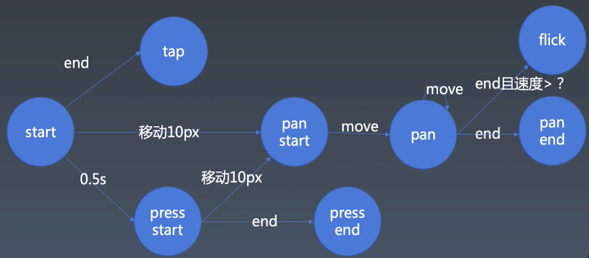

# 抽象动画

> `TODO` 上周内容未全部完成，加班较多，本周补上

## 把 Carousel 类封装为一个模块

## 编写 Animation 类

一个最基础的动画能力是每一帧去执行一些事件

### 帧

javascript 里面处理帧的几种方式：

- setInterval

```js
setInterval(() => {}, 16);
```

注：一般的动画是有一个 16ms 的基本操作，人眼能识别的最高帧率是 60 帧，一般来说浏览器或者游戏都是 60 帧

- setTimeout

```js
let tick = () => {
  setTimeout(tick, 16);
};
```

- requestAnimationFrame
  申请浏览器执行下一帧的时候执行代码，跟随浏览器的帧频来执行，如果浏览器做了降帧降频的操作，它也会跟着变化

```js
let tick = () => {
  requestAnimationFrame(tick);
};
```

现代浏览器环境中推荐使用 tick 函数（setTimeout/requestAnimationFrame），原因：

1. setInterval 不是很可控，浏览器不一定会按照 16ms 去执行
2. tick 写得不好的时候执行的时候 setInterval 会发生积压，setInterval 还没执行完就下一次开始，不同浏览器的底层策略不一致

### 使用 requestAnimationFrame 做一个时间线的操作

#### 初步建立动画与时间线

- cancelAnimationFrame

```js
// 用法
let tick = () => {
  let handler = requestAnimationFrame(tick);
  cancelAnimationFrame(handler);
};
```

- 设计 Timeline 类

Amination.js

```js
const TICK = Symbol("tick");
const TICK_HANDLER = Symbol("tick-handler");
export class Timeline {
  constructor() {
    this[TICK] = () => {
      console.info("tick trigger");
      requestAnimationFrame(this[TICK]);
    };
  }
  // 开始
  start() {
    this[TICK]();
  }
  // 播放速率
  set rate() {}
  get rate() {}
  pause() {} // 暂停
  resume() {} // 恢复
  reset() {} // 重启
}
```

main.js

```js
import { Timeline } from './Animation'
...
let tl = new Timeline()
tl.start()
```

- 设计 animation 类

```js
// 属性动画：把一个对象的某个属性从一个值变成另外一个值
// 帧动画：每一秒来一张图片
export class Animation {
  /**
   * object, property, startValue, endValue, duration这五个属性是必选参数
   * timingFunction差值函数
   * */
  constructor(
    object,
    property,
    startValue,
    endValue,
    duration,
    timingFunction
  ) {
    this.object = object;
    this.property = property;
    this.startValue = startValue;
    this.endValue = endValue;
    this.duration = duration;
    this.timingFunction = timingFunction;
  }
  receiveTime(time) {
    let range = this.endValue - this.startValue;
    this.object[this.property] =
      this.startValue + (range * time) / this.duration;
  }
}
```

- 执行 Animation

Amination.js

```js
const TICK = Symbol("tick");
const TICK_HANDLER = Symbol("tick-handler");
const ANIMATIONS = Symbol("animations");

export class Timeline {
  constructor() {
    // 添加animation队列
    this[ANIMATIONS] = new Set();
  }
  // 开始
  start() {
    let startTime = Date.now();
    this[TICK] = () => {
      console.info("tick trigger");
      for (let animation of this[ANIMATIONS]) {
        animation.receiveTime(Date.now() - startTime);
      }
      requestAnimationFrame(this[TICK]);
    };
    this[TICK]();
  }
  // 播放速率
  // set rate(){}
  // get rate(){}
  pause() {} // 暂停
  resume() {} // 恢复
  reset() {} // 重启

  // 添加动画
  add(animation) {
    this[ANIMATIONS].add(animation);
  }
}

// 属性动画：把一个对象的某个属性从一个值变成另外一个值
// 帧动画：每一秒来一张图片
export class Animation {
  /**
   * object, property, startValue, endValue, duration这五个属性是必选参数
   * timingFunction差值函数
   * */
  constructor(
    object,
    property,
    startValue,
    endValue,
    duration,
    timingFunction
  ) {
    this.object = object;
    this.property = property;
    this.startValue = startValue;
    this.endValue = endValue;
    this.duration = duration;
    this.timingFunction = timingFunction;
  }
  receiveTime(time) {
    console.info("time =>", time);
    let range = this.endValue - this.startValue;
    this.object[this.property] =
      this.startValue + (range * time) / this.duration;
  }
}
```

main.js

```js
import { Timeline, Animation } from './Animation'

...

let tl = new Timeline()
tl.add(new Animation({}, 'a', 0, 1000, 1000, null))
tl.start()
```

- 设置移除动画的条件

```js
// setTimeout
// setInterval
// tick

const TICK = Symbol("tick");
const TICK_HANDLER = Symbol("tick-handler");
const ANIMATIONS = Symbol("animations");

export class Timeline {
  constructor() {
    // 添加animation队列
    this[ANIMATIONS] = new Set();
  }
  // 开始
  start() {
    let startTime = Date.now();
    this[TICK] = () => {
      let t = Date.now() - startTime;
      for (let animation of this[ANIMATIONS]) {
        let t0 = t;
        if (animation.duration < t) {
          this[ANIMATIONS].delete(animation);
          t0 = animation.duration;
        }
        animation.receiveTime(t0);
      }
      requestAnimationFrame(this[TICK]);
    };
    this[TICK]();
  }
  // 播放速率
  // set rate(){}
  // get rate(){}
  pause() {} // 暂停
  resume() {} // 恢复
  reset() {} // 重启

  // 添加动画
  add(animation) {
    this[ANIMATIONS].add(animation);
  }
}

// 属性动画：把一个对象的某个属性从一个值变成另外一个值
// 帧动画：每一秒来一张图片
export class Animation {
  /**
   * object, property, startValue, endValue, duration这五个属性是必选参数
   * timingFunction差值函数
   * */
  constructor(
    object,
    property,
    startValue,
    endValue,
    duration,
    timingFunction
  ) {
    this.object = object;
    this.property = property;
    this.startValue = startValue;
    this.endValue = endValue;
    this.duration = duration;
    this.timingFunction = timingFunction;
  }
  receiveTime(time) {
    console.info("time =>", this.object[this.property]);
    let range = this.endValue - this.startValue;
    this.object[this.property] =
      this.startValue + (range * time) / this.duration;
  }
}
```

#### 设计时间线的更新

Animation.js

```js
const TICK = Symbol("tick");
const TICK_HANDLER = Symbol("tick-handler");
const ANIMATIONS = Symbol("animations");
const START_TIME = Symbol("start-time");

export class Timeline {
  constructor() {
    // 添加animation队列
    this[ANIMATIONS] = new Set();
    this[START_TIME] = new Map();
  }
  // 开始
  start() {
    let startTime = Date.now();
    this[TICK] = () => {
      // let t = Date.now() - startTime
      let now = Date.now();

      for (let animation of this[ANIMATIONS]) {
        let t;
        if (this[START_TIME].get(animation) < startTime) {
          t = now - startTime;
        } else {
          t = now - this[START_TIME].get(animation);
        }
        if (animation.duration < t) {
          this[ANIMATIONS].delete(animation);
          t = animation.duration;
        }
        animation.receiveTime(t);
      }
      requestAnimationFrame(this[TICK]);
    };
    this[TICK]();
  }
  pause() {} // 暂停
  resume() {} // 恢复
  reset() {} // 重启

  // 添加动画
  add(animation, startTime) {
    if (arguments.length < 2) {
      startTime = Date.now();
    }
    this[ANIMATIONS].add(animation);
    this[START_TIME].set(animation, startTime);
  }
}

// 属性动画：把一个对象的某个属性从一个值变成另外一个值
// 帧动画：每一秒来一张图片
export class Animation {
  /**
   * object, property, startValue, endValue, duration这五个属性是必选参数
   * timingFunction差值函数
   * */
  constructor(
    object,
    property,
    startValue,
    endValue,
    duration,
    delay,
    timingFunction
  ) {
    this.object = object;
    this.property = property;
    this.startValue = startValue;
    this.endValue = endValue;
    this.duration = duration;
    this.timingFunction = timingFunction;
    this.delay = delay;
  }
  receiveTime(time) {
    console.info("time =>", this.object[this.property]);
    let range = this.endValue - this.startValue;
    this.object[this.property] =
      this.startValue + (range * time) / this.duration;
  }
}
```

main.js

```js
import { Timeline, Animation } from "./Animation";

let tl = new Timeline();

// 把tl挂载到window上，在console里面动态执行tl.add(animation)
window.tl = tl;
window.animation = new Animation({}, "a", 0, 100, 1000, null);

tl.start();
```

#### 给动画添加暂停和重启功能

> 改进 pause&resume 方法

```js
 start () {
    ...
    this[TICK_HANDLER] = requestAnimationFrame(this[TICK])
 }
 // 暂停
 pause () {
     cancelAnimationFrame(this[TICK_HANDLER])
 }
 // 恢复
 resume () {
     this[TICK_HANDLER]
 }
```

> 添加 DOM 操作相关 demo

新添加文件`AnimationDemo.html`&`AnimationDemo.js`

AnimationDemo.html

```html
<body>
  <div
    id="el"
    style="width:100px;height:100px;background-color: lightblue;"
  ></div>
  <script type="module" src="./AnimationDemo.js"></script>
</body>
```

AnimationDemo.js

```js
import { Timeline, Animation } from "./Animation.js";
let tl = new Timeline();

tl.start();
tl.add(
  new Animation(
    document.querySelector("#el").style, // DOM element
    "transform", // property
    0, // startValue
    500, // endValue
    2000, // duration
    0, // delay
    null, // timingFunction
    (v) => `translateX(${v}px)` // template
  )
);
```

> 在变量 t 上做处理减去暂停时间

AnimationDemo.html

```html
<body>
  <div
    id="el"
    style="width:100px;height:100px;background-color: lightblue;"
  ></div>
  <button id="pause-btn">pause</button>
  <button id="resume-btn">resume</button>
  <script type="module" src="./AnimationDemo.js"></script>
</body>
```

AnimationDemo.js

```js
import { Timeline, Animation } from "./Animation.js";
let tl = new Timeline();

tl.start();
tl.add(
  new Animation(
    document.querySelector("#el").style, // DOM element
    "transform", // property
    0, // startValue
    500, // endValue
    2000, // duration
    0, // delay
    null, // timingFunction
    (v) => `translateX(${v}px)` // template
  )
);

document
  .querySelector("#pause-btn")
  .addEventListener("click", (e) => tl.pause());

document
  .querySelector("#resume-btn")
  .addEventListener("click", (e) => tl.resume());
```

Animation.js

```js
const TICK = Symbol("tick");
const TICK_HANDLER = Symbol("tick-handler");
const ANIMATIONS = Symbol("animations");
const START_TIME = Symbol("start-time");
const PAUSE_START = Symbol("pause-start");
const PAUSE_TIME = Symbol("pause-time");

export class Timeline {
  constructor() {
    // 添加animation队列
    this[ANIMATIONS] = new Set();
    this[START_TIME] = new Map();
  }
  // 开始
  start() {
    let startTime = Date.now();
    // 初始化的暂停时间为0
    this[PAUSE_TIME] = 0;
    this[TICK] = () => {
      // let t = Date.now() - startTime
      let now = Date.now();

      for (let animation of this[ANIMATIONS]) {
        let t;
        if (this[START_TIME].get(animation) < startTime) {
          t = now - startTime - this[PAUSE_TIME];
        } else {
          t = now - this[START_TIME].get(animation) - this[PAUSE_TIME];
        }
        if (animation.duration < t) {
          this[ANIMATIONS].delete(animation);
          t = animation.duration;
        }
        animation.receiveTime(t);
      }
      this[TICK_HANDLER] = requestAnimationFrame(this[TICK]);
    };
    this[TICK]();
  }
  // 播放速率
  pause() {
    this[PAUSE_START] = Date.now();
    cancelAnimationFrame(this[TICK_HANDLER]);
  } // 暂停
  resume() {
    this[PAUSE_TIME] += Date.now() - this[PAUSE_START];
    this[TICK]();
  } // 恢复
  reset() {} // 重启

  // 添加动画
  add(animation, startTime) {
    if (arguments.length < 2) {
      startTime = Date.now();
    }
    this[ANIMATIONS].add(animation);
    this[START_TIME].set(animation, startTime);
  }
}

// 属性动画：把一个对象的某个属性从一个值变成另外一个值
// 帧动画：每一秒来一张图片
export class Animation {
  /**
   * object, property, startValue, endValue, duration这五个属性是必选参数
   * timingFunction差值函数
   * */
  constructor(
    object,
    property,
    startValue,
    endValue,
    duration,
    delay,
    timingFunction,
    template
  ) {
    this.object = object;
    this.property = property;
    this.startValue = startValue;
    this.endValue = endValue;
    this.duration = duration;
    this.timingFunction = timingFunction;
    this.delay = delay;
    this.template = template;
  }
  receiveTime(time) {
    console.info("time =>", this.object[this.property]);
    let range = this.endValue - this.startValue;
    this.object[this.property] = this.template(
      this.startValue + (range * time) / this.duration
    );
  }
}
```

#### 完善 delay 和 timingFunction 参数的实现

> 添加完善 delay 参数与延时实现

```js
// Animation.js

const TICK = Symbol("tick");
const TICK_HANDLER = Symbol("tick-handler");
const ANIMATIONS = Symbol("animations");
const START_TIME = Symbol("start-time");
const PAUSE_START = Symbol("pause-start");
const PAUSE_TIME = Symbol("pause-time");

export class Timeline {
  constructor() {
    // 添加animation队列
    this[ANIMATIONS] = new Set();
    this[START_TIME] = new Map();
    this.isPausing = false; // 是否正在暂停状态
  }
  // 开始
  start() {
    let startTime = Date.now();
    // 初始化的暂停时间为0
    this[PAUSE_TIME] = 0;
    this[TICK] = () => {
      // let t = Date.now() - startTime
      let now = Date.now();

      for (let animation of this[ANIMATIONS]) {
        let t;
        if (this[START_TIME].get(animation) < startTime)
          t = now - startTime - this[PAUSE_TIME] - animation.delay;
        else
          t =
            now -
            this[START_TIME].get(animation) -
            this[PAUSE_TIME] -
            animation.delay;

        if (animation.duration < t) {
          this[ANIMATIONS].delete(animation);
          t = animation.duration;
        }
        // 当t < 0的时候说明延时dealy还没有结束，动画还没有开始
        if (t > 0) animation.receiveTime(t);
      }
      this[TICK_HANDLER] = requestAnimationFrame(this[TICK]);
    };
    this[TICK]();
  }
  // 播放速率
  // 暂停
  pause() {
    // 判断是否处于暂停状态，如果是暂停中则不执行暂停函数
    if (this.isPausing) return false;
    this[PAUSE_START] = Date.now();
    cancelAnimationFrame(this[TICK_HANDLER]);
    this.isPausing = true;
  }
  // 恢复
  resume() {
    // 判断是否处于暂停状态，如果不是暂停中则不执行恢复函数
    if (!this.isPausing) return false;
    this[PAUSE_TIME] += Date.now() - this[PAUSE_START];
    this[TICK]();
    this.isPausing = false;
  }
  // 重启
  reset() {}
  // 添加动画
  add(animation, startTime) {
    if (arguments.length < 2) {
      startTime = Date.now();
    }
    this[ANIMATIONS].add(animation);
    this[START_TIME].set(animation, startTime);
  }
}

// 属性动画：把一个对象的某个属性从一个值变成另外一个值
// 帧动画：每一秒来一张图片
export class Animation {
  /**
   * object, property, startValue, endValue, duration这五个属性是必选参数
   * timingFunction差值函数
   * */
  constructor(
    object,
    property,
    startValue,
    endValue,
    duration,
    delay,
    timingFunction,
    template
  ) {
    this.object = object;
    this.property = property;
    this.startValue = startValue;
    this.endValue = endValue;
    this.duration = duration;
    this.timingFunction = timingFunction;
    this.delay = delay;
    this.template = template;
  }
  receiveTime(time) {
    console.info("time =>", this.object[this.property]);
    let range = this.endValue - this.startValue;
    this.object[this.property] = this.template(
      this.startValue + (range * time) / this.duration
    );
  }
}
```

> 添加完善 timingFunction 参数与实现

Ease.js

```js
export function cubicBezier(p1x, p1y, p2x, p2y) {
  const ZERO_LIMIT = 1e-6;

  //Calculate the polynomial coefficients,

  //implicit first and last control points are(0, 0) and(1, 1) .

  const ax = 3 * p1x - 3 * p2x + 1;

  const bx = 3 * p2x - 6 * p1x;

  const cx = 3 * p1x;

  const ay = 3 * p1y - 3 * p2y + 1;

  const by = 3 * p2y - 6 * p1y;

  const cy = 3 * p1y;

  function sampleCurveDerivativeX(t) {
    //`axt^3+b xt^2+cxt'expanded using Horner's rule.
    return (3 * ax * t + 2 * bx) * t + cx;
  }

  function sampleCurveX(t) {
    return ((ax * t + bx) * t + cx) * t;
  }

  function sampleCurveY(t) {
    return ((ay * t + by) * t + cy) * t;
  }

  //Given an x value, find a parametric value it came from.

  function solveCurveX(x) {
    var t2 = x;
    var derivative;
    var x2;

    //https：//trac.webkit.org/browser/trunk/Source/WebCore/platform/animation
    //First try a few iterations of Newton's method--normally very fast.
    //http：//en.wikipedia.org/wiki/Newton's_method

    for (let i = 0; i < 8; i++) {
      //f(t)-x=0

      x2 = sampleCurveX(t2) - x;

      if (Math.abs(x2) < ZERO_LIMIT) return t2;

      derivative = sampleCurveDerivativeX(t2);

      //==0, failure
      /*istanbul ignore if*/

      if (Math.abs(derivative) < ZERO_LIMIT) {
        break;
      }

      t2 -= x2 / derivative;
    }
    //Fallback to the bisection method for reliability.
    //bisection
    //http：//en.wikipedia.org/wiki/Bisection_method

    var t1 = 1;

    /*istanbul ignore next*/

    var to = 0;

    /*istanbul ignore next*/

    t2 = x;

    /*istanbul ignore next*/

    while (t1 > to) {
      x2 = sampleCurveX(t2) - x;
      if (Math.abs(x2) < ZERO_LIMIT) {
        return t2;
      }
      if (x2 > 0) {
        t1 = t2;
      } else {
        to = t2;
      }
      t2 = (t1 + t0) / 2;
    }

    //Failure
    return t2;
  }

  function solve(x) {
    return sampleCurveY(solveCurveX(x));
  }

  return solve;
}

export let ease = cubicBezier(0.25, 0.1, 0.25, 1);

export let linear = cubicBezier(0, 0, 1, 1);

export let easeOut = cubicBezier(0, 0, 0.58, 1);

export let easeIn = cubicBezier(0.42, 0, 1, 1);

export let easeInOut = cubicBezier(0.42, 0, 0.58, 1);
```

Animation.js

```js

...

export class Timeline {

...

}

// 属性动画：把一个对象的某个属性从一个值变成另外一个值
// 帧动画：每一秒来一张图片
export class Animation {
    /**
     * object, property, startValue, endValue, duration这五个属性是必选参数
     * timingFunction差值函数
     * */
    constructor(object, property, startValue, endValue, duration, delay, timingFunction, template) {
        // 加上timingFunction和template的默认值处理
        timingFunction = timingFunction || (v => v)
        template = template || (v => v)

        this.object = object
        this.property = property
        this.startValue = startValue
        this.endValue = endValue
        this.duration = duration
        this.timingFunction = timingFunction
        this.delay = delay
        this.template = template
    }
    receiveTime (time) {
        console.info('time =>', this.object[this.property])
        let range = (this.endValue - this.startValue)
        // 使用timingFunction处理动画的进度
        let progress = this.timingFunction(time / this.duration)
        this.object[this.property] = this.template(this.startValue + range * progress)
    }
}
```

AnimationDemo.js

```js
import { Timeline, Animation } from "./Animation.js";
import { ease } from "./Ease.js";
let tl = new Timeline();

tl.start();
tl.add(
  new Animation(
    document.querySelector("#el").style, // DOM element
    "transform", // property
    0, // startValue
    500, // endValue
    2000, // duration
    0, // delay
    ease, // timingFunction
    (v) => `translateX(${v}px)` // template
  )
);

document
  .querySelector("#pause-btn")
  .addEventListener("click", (e) => tl.pause());

document
  .querySelector("#resume-btn")
  .addEventListener("click", (e) => tl.resume());
```

> 测试比对不同 timingFunction 效果

AnimationDemo.js

```js
import { Timeline, Animation } from "./Animation.js";
import { ease, easeIn, easeOut, easeInOut, linear } from "./Ease.js";
let tl = new Timeline();

tl.start();

const TIMING_FUNCTIONS = [ease, easeIn, easeOut, easeInOut, linear];

TIMING_FUNCTIONS.map((func, index) => {
  tl.add(
    new Animation(
      document.querySelector(`#el${index || ""}`).style, // DOM element
      "transform", // property
      0, // startValue
      500, // endValue
      2000, // duration
      0, // delay
      func, // timingFunction
      (v) => `translateX(${v}px)` // template
    )
  );
});

document
  .querySelector("#pause-btn")
  .addEventListener("click", (e) => tl.pause());

document
  .querySelector("#resume-btn")
  .addEventListener("click", (e) => tl.resume());
```

AnimationDemo.html

```html
<body>
  <div
    id="el"
    style="width:100px;height:100px;background-color: lightblue;"
  ></div>
  <div
    id="el1"
    style="width:100px;height:100px;background-color: lightblue;"
  ></div>
  <div
    id="el2"
    style="width:100px;height:100px;background-color: lightblue;"
  ></div>
  <div
    id="el3"
    style="width:100px;height:100px;background-color: lightblue;"
  ></div>
  <div
    id="el4"
    style="width:100px;height:100px;background-color: lightblue;"
  ></div>
  <button id="pause-btn">pause</button>
  <button id="resume-btn">resume</button>
  <script type="module" src="./AnimationDemo.js"></script>
</body>
```

> 测试 timingFunction 和 css 动画效果

AnimationDemo.html

```html
<body>
  <div
    id="el"
    style="width:100px;height:100px;background-color: lightblue;"
  ></div>
  <div id="css" style="width:100px;height:100px;background-color: red;"></div>
  <!-- <div id="el1" style="width:100px;height:100px;background-color: lightblue;"></div>
    <div id="el2" style="width:100px;height:100px;background-color: lightblue;"></div>
    <div id="el3" style="width:100px;height:100px;background-color: lightblue;"></div>
    <div id="el4" style="width:100px;height:100px;background-color: lightblue;"></div> -->
  <button id="pause-btn">pause</button>
  <button id="resume-btn">resume</button>
  <script type="module" src="./AnimationDemo.js"></script>
</body>
```

AnimationDemo.js

```js
import { Timeline, Animation } from "./Animation.js";
import { ease, easeIn, easeOut, easeInOut, linear } from "./Ease.js";
let tl = new Timeline();

tl.start();

// const TIMING_FUNCTIONS = [
//     ease,
//     easeIn,
//     easeOut,
//     easeInOut,
//     linear
// ]

// TIMING_FUNCTIONS.map((func, index) => {
//     tl.add(
//         new Animation(
//             document.querySelector(`#el${index || ''}`).style, // DOM element
//             'transform', // property
//             0, // startValue
//             500, // endValue
//             2000, // duration
//             0, // delay
//             func, // timingFunction
//             v => `translateX(${v}px)` // template
//         )
//     )
// })

// js实现
tl.add(
  new Animation(
    document.querySelector(`#el`).style, // DOM element
    "transform", // property
    0, // startValue
    500, // endValue
    2000, // duration
    0, // delay
    ease, // timingFunction
    (v) => `translateX(${v}px)` // template
  )
);

// 纯css实现
document.querySelector(`#css`).style.transition = "ease 2s";
document.querySelector(`#css`).style.transform = "translateX(500px)";

document
  .querySelector("#pause-btn")
  .addEventListener("click", (e) => tl.pause());

document
  .querySelector("#resume-btn")
  .addEventListener("click", (e) => tl.resume());
```

=> 执行过程有细微的差异是 c++ 与 js 计算的误差导致的

> 完善 reset 功能

Animation.js

```js

export class Timeline {
    ...
    reset () {
        this.pause()
        this.isPausing = false // 是否正在暂停状态
        this[ANIMATIONS] = new Set()
        this[START_TIME] = new Map()
        this[TICK_HANDLER] = null
        this[PAUSE_START] = 0
        this[PAUSE_TIME] = 0
    }
    ...

}
```

#### 对时间线进行管理

需要控制动画的状态，从而防止用户的一些不合理的操作
之前自己已经写相关变量 isPausing，控制用户对按钮 pause & resume 按钮的反复操作
但是没有联想到状态管理并应用

Animation.js

```js
...

export class Timeline {
    constructor() {
        // 添加animation队列
        ...
    }
    // 开始
    start(){
        if (this.state !== 'Inited') return false
        this.state = 'Started'
        ...
    }
    // 播放速率
    // 暂停
    pause () {
        if (this.state !== 'Started') return false
        this.state = 'Paused'
        ...
    }
    // 恢复
    resume () {
        if (this.state !== 'Paused') return false
        this.state = 'Started'
        ...
    }
    // 重置
    reset () {
        this.pause()
        this.isPausing = false // 是否正在暂停状态
        this[ANIMATIONS] = new Set()
        this[START_TIME] = new Map()
        this[TICK_HANDLER] = null
        this[PAUSE_START] = 0
        this[PAUSE_TIME] = 0
    }
    // 添加动画
    add (animation, startTime) {
        if (arguments.length < 2) {
            startTime = Date.now()
        }
        this[ANIMATIONS].add(animation)
        this[START_TIME].set(animation, startTime)
    }

}

// 属性动画：把一个对象的某个属性从一个值变成另外一个值
// 帧动画：每一秒来一张图片
export class Animation {
    ...
}
```

### 手势基础

#### 手势的基本模型抽象



#### 浏览器 mouse && touch 事件模型

> mouse && touch 事件模型抽象

- touchcancel 的触发机制

```js
let element = document.documentElement;

/**
 * mouse实践抽象模型
 */

element.addEventListener("mousedown", (e) => {
  mousemove = (e) => {
    console.info(e.clientX, e.clientY);
  };
  mouseup = (e) => {
    element.removeEventListener("mousemove", mousemove);
    element.removeEventListener("mouseup", mouseup);
  };
  element.addEventListener("mousemove", mousemove);
  element.addEventListener("mouseup", mouseup);
});

/**
 * touch事件抽象
 */

element.addEventListener("touchstart", (e) => {
  console.info(e.changedTouches);
  for (let touch of e.changedTouches) {
    console.info("start", touch.clientX, touch.clientY);
  }
});

element.addEventListener("touchmove", (e) => {
  for (let touch of e.changedTouches) {
    console.info("move", touch.clientX, touch.clientY);
  }
});

element.addEventListener("touchend", (e) => {
  for (let touch of e.changedTouches) {
    console.info("end", touch.clientX, touch.clientY);
  }
});

element.addEventListener("touchcancel", (e) => {
  for (let touch of e.changedTouches) {
    console.info("cancel", touch.clientX, touch.clientY);
  }
});

/**
 * 类似于系统中的全局事件会把正在进行的touch事件cancel掉，
 * 如下setTimeout代码执行的时候如果正在touchmove会触发
 * touchcancel事件监听
 */
setTimeout(() => window.alert("###"), 3000);
```

- 初步抽象

```js
...

element.addEventListener('mousedown', e => {
    mousemove = e => {
        start(e)
    }
    mouseup = e => {
        end(e)
        ...
    }
    ...
})

element.addEventListener('touchstart', e => {
    for (let touch of e.changedTouches) {
        start(touch)
    }
})

element.addEventListener('touchmove', e => {
    for (let touch of e.changedTouches) {
        move(touch)
    }
})

element.addEventListener('touchend', e => {
    for (let touch of e.changedTouches) {
        end(touch)
    }
})

element.addEventListener('touchcancel', e => {
    for (let touch of e.changedTouches) {
        cancel(touch)
    }
})

...

let start = event => {
    console.info('start', event.clientX, event.clientY)
}

let move = event => {
    console.info('move', event.clientX, event.clientY)
}

let end = event => {
    console.info('end', event.clientX, event.clientY)
}

let cancel = event => {
    console.info('cancel', event.clientX, event.clientY)
}
```

- 完善 touch 事件流

```js
...
let handler
let startX, startY
let isPan = false
let isTap = true
let isPress = false
let start = point => {
    // console.info('start', point.clientX, point.clientY)
    startX = point.clientX, startY = point.clientY
    isPan = false
    isTap = true
    isPress = false
    handler = setTimeout(() => {
        isPan = false
        isTap = false
        isPress = true
        // 避免多次clearTimeout
        handler = null
        console.info('press')
    }, 500)
}

let move = point => {
    // 判断是否移动10px来判断是否触发了pan事件
    dx = point.clientX - startX, dy = point.clientY - startY
    if (!isPan && (dx ** 2 + dy ** 2) > 100) {
        isPan = true
        isTap = false
        isPress = false
        clearTimeout(handler)
        console.info('startPan')
    }

    if (isPan) {
        console.info('Pan', dx, dy)
    }
    // console.info('move', point.clientX, point.clientY)
}

let end = point => {
    if (isTap) {
        console.info('tap')
        clearTimeout(handler)
    }
    if (isPan) {
        console.info('panend')
    }
    if (isPress) {
        console.info('pressend')
    }
    // console.info('end', point.clientX, point.clientY)
}

let cancel = point => {
    clearTimeout(handler)
    // console.info('cancel', point.clientX, point.clientY)
}
```

- 全局变量的处理

由于 touch 事件在实际的触屏操作可能会触发多个实例, 鼠标事件也会有左右键的区分，所以可以通过实例的唯一标识 identifer 设置 context 作为参数传入

```js
...
/**
 * touch事件抽象
*/
let contexts = new Map()

element.addEventListener('touchstart', e => {
    console.info(e.changedTouches)
    for (let touch of e.changedTouches) {
        let context = Object.create(null)
        contexts.set(touch.identifier, context)
        start(touch, context)
    }
})

element.addEventListener('touchmove', e => {
    for (let touch of e.changedTouches) {
        let context = contexts.get(touch.identifier)
        move(touch, context)
    }
})

element.addEventListener('touchend', e => {
    for (let touch of e.changedTouches) {
        let context = contexts.get(touch.identifier)
        end(touch, context)
        contexts.delete(touch.identifier)
    }
})

element.addEventListener('touchcancel', e => {
    for (let touch of e.changedTouches) {
        let context = contexts.get(touch.identifier)
        cancel(touch, context)
        contexts.delete(touch.identifier)
    }
})

/**
 * 类似于系统中的全局事件会把正在进行的touch事件cancel掉，
 * 如下setTimeout代码执行的时候如果正在touchmove会触发
 * touchcancel事件监听
*/
// setTimeout(() => window.alert('###'), 3000)
let start = (point, context) => {
    // console.info('start', point.clientX, point.clientY)
    context.startX = point.clientX, context.startY = point.clientY
    context.isPan = false
    context.isTap = true
    context.isPress = false
    context.handler = setTimeout(() => {
        context.isPan = false
        context.isTap = false
        context.isPress = true
        // 避免多次clearTimeout
        context.handler = null
        console.info('press')
    }, 500)
}

let move = (point, context) => {
    // 判断是否移动10px
    dx = point.clientX - context.startX, dy = point.clientY - context.startY
    if (!context.isPan && (dx ** 2 + dy ** 2) > 100) {
        context.isPan = true
        context.isTap = false
        context.isPress = false
        clearTimeout(context.handler)
        console.info('startPan')
    }

    if (context.isPan) {
        console.info('Pan', dx, dy)
    }
    // console.info('move', point.clientX, point.clientY)
}

let end = (point, context) => {
    if (context.isTap) {
        console.info('tap')
        clearTimeout(context.handler)
    }
    if (context.isPan) {
        console.info('panend')
    }
    if (context.isPress) {
        console.info('pressend')
    }
    // console.info('end', point.clientX, point.clientY)
}

let cancel = (point, context) => {
    clearTimeout(context.handler)
    // console.info('cancel', point.clientX, point.clientY)
}
```

- 鼠标事件的处理

由于没有加上鼠标事件的 context，在 start，move 等函数中会报错

```js
let element = document.documentElement;

let isListeningMouse = false;
/**
 * mouse实践抽象模型
 */
element.addEventListener("mousedown", (e) => {
  let context = Object.create(null);
  contexts.set(`mouse${1 << e.button}`, context);
  start(e, context);
  mousemove = (e) => {
    let button = 1;
    while (button <= e.buttons) {
      // console.info('button', button)
      // console.info('buttons', e.buttons)
      if (button && e.buttons) {
        let key;
        /**
         * event.button和event.buttons的关系: 1 << event.button === event.buttons
         * (buttons的滚轮和右键需要反转)
         */
        if (button === 2) key = 4;
        else if (button === 4) key = 2;
        else key = button;
        let context = contexts.get(`mouse${key}`);
        // console.info(':', `mouse${key}`)
        // console.info('::', contexts)
        // console.info(':::', context)
        if (context) move(e, context);
      }
      button = button << 1;
    }
  };
  mouseup = (e) => {
    // console.info('over.e', e)
    let context = contexts.get(`mouse${1 << e.button}`);
    if (context) end(e, context);
    contexts.delete(`mouse${1 << e.button}`);
    if (e.buttons === 0) {
      element.removeEventListener("mousemove", mousemove);
      element.removeEventListener("mouseup", mouseup);
      isListeningMouse = false;
    }
  };
  if (!isListeningMouse) {
    element.addEventListener("mousemove", mousemove);
    element.addEventListener("mouseup", mouseup);
    isListeningMouse = true;
  }
});

/**
 * touch事件抽象
 */
let contexts = new Map();

element.addEventListener("touchstart", (e) => {
  console.info(e.changedTouches);
  for (let touch of e.changedTouches) {
    let context = Object.create(null);
    contexts.set(touch.identifier, context);
    start(touch, context);
  }
});

element.addEventListener("touchmove", (e) => {
  for (let touch of e.changedTouches) {
    let context = contexts.get(touch.identifier);
    move(touch, context);
  }
});

element.addEventListener("touchend", (e) => {
  for (let touch of e.changedTouches) {
    let context = contexts.get(touch.identifier);
    end(touch, context);
    contexts.delete(touch.identifier);
  }
});

element.addEventListener("touchcancel", (e) => {
  for (let touch of e.changedTouches) {
    let context = contexts.get(touch.identifier);
    cancel(touch, context);
    contexts.delete(touch.identifier);
  }
});

/**
 * 类似于系统中的全局事件会把正在进行的touch事件cancel掉，
 * 如下setTimeout代码执行的时候如果正在touchmove会触发
 * touchcancel事件监听
 */
// setTimeout(() => window.alert('###'), 3000)
let start = (point, context) => {
  (context.startX = point.clientX), (context.startY = point.clientY);
  context.isPan = false;
  context.isTap = true;
  context.isPress = false;
  context.handler = setTimeout(() => {
    context.isPan = false;
    context.isTap = false;
    context.isPress = true;
    // 避免多次clearTimeout
    context.handler = null;
    console.info("press");
  }, 500);
};

let move = (point, context) => {
  // 判断是否移动10px
  (dx = point.clientX - context.startX), (dy = point.clientY - context.startY);
  if (!context.isPan && dx ** 2 + dy ** 2 > 100) {
    context.isPan = true;
    context.isTap = false;
    context.isPress = false;
    clearTimeout(context.handler);
    console.info("startPan");
  }

  if (context.isPan) {
    console.info("Pan", dx, dy);
  }
};

let end = (point, context) => {
  if (context.isTap) {
    console.info("tap");
    clearTimeout(context.handler);
  }
  if (context.isPan) {
    console.info("panend");
  }
  if (context.isPress) {
    console.info("pressend");
  }
};

let cancel = (point, context) => {
  clearTimeout(context.handler);
};
```

- 事件派发- EventDispatch

```js

let end = (point, context) => {
    if (context.isTap) {
        // console.info('tap')
        dispatch('singletap', {})
        clearTimeout(context.handler)
    }
    if (context.isPan) {
        console.info('panend')
    }
    if (context.isPress) {
        console.info('pressend')
    }
}

...

// 事件派发逻辑函数

function dispatch (type, properties) {
    let event = new Event(type)
    for (let name in properties) {
        event[name] = properties[name]
    }
    element.dispatchEvent(event)
}
```

```html
<body></body>
<script>
  ...

  document.documentElement.addEventListener('singletap', e => {
    console.info(e, 'tap trigger')
  })
</script>
```

- flick 事件实现

```js

...

let start = (point, context) => {
    ...
    // points是move保存一系列的点的数组，此处是初始化
    context.points = [{
        t: Date.now(),
        x: point.clientX,
        y: point.clientY
    }]
    ...
}

let move = (point, context) => {
    ...
    // 由于move是连续触发的事件，需要限制一下时间段半秒以内的不写入数组
    context.points = context.points.filter(point => Date.now() - point.t < 500)
    context.points.push({
        t: Date.now(),
        x: point.clientX,
        y: point.clientY
    })
}

let end = (point, context) => {
    ...
    context.points = context.points.filter(point => Date.now() - point.t < 500)
    // 抬起鼠标的时候先算出起始距离，再根据时间差计算出鼠标抬起时的速度
    let velocity, distance
    if (!context.points.length) {
        velocity = 0
    } else {
        distance = Math.sqrt(
            (point.clientX - context.points[0].x) ** 2 +
            (point.clientY - context.points[0].y) ** 2
        )
        velocity = distance / (Date.now() - context.points[0].t)
    }
    // 判断速度超过一个基准值的时候，派发flick事件， 并给context添加flick标识
    if (velocity > 1.5) {
        context.isFlick = true
        dispatch('flick', {})
    } else {
        context.isFlick = false
    }
}

let cancel = (point, context) => {
    ...
}

// 事件派发
function dispatch (type, properties) {
    ...
}
```

- 封装事件模型

> 抽象一个过程 listen(监听) => recognize(识别) => dispatch(事件分发)

```js
export class Listener {
  constructor(element, recognize) {
    this.element = element;

    let isListeningMouse = false;

    /**
     * mouse实践抽象模型
     */

    element.addEventListener("mousedown", (e) => {
      let context = Object.create(null);
      contexts.set(`mouse${1 << e.button}`, context);
      recognize.start(e, context);
      let mousemove = (e) => {
        let button = 1;
        while (button <= e.buttons) {
          // console.info('button', button)
          // console.info('buttons', e.buttons)
          if (button && e.buttons) {
            let key;
            /**
             * event.button和event.buttons的关系: 1 << event.button === event.buttons
             * (buttons的滚轮和右键需要反转)
             */
            if (button === 2) key = 4;
            else if (button === 4) key = 2;
            else key = button;
            let context = contexts.get(`mouse${key}`);
            // console.info(':', `mouse${key}`)
            // console.info('::', contexts)
            // console.info(':::', context)
            if (context) recognize.move(e, context);
          }
          button = button << 1;
        }
      };
      let mouseup = (e) => {
        // console.info('over.e', e)
        let context = contexts.get(`mouse${1 << e.button}`);
        if (context) recognize.end(e, context);
        contexts.delete(`mouse${1 << e.button}`);
        if (e.buttons === 0) {
          document.removeEventListener("mousemove", mousemove);
          document.removeEventListener("mouseup", mouseup);
          isListeningMouse = false;
        }
      };
      if (!isListeningMouse) {
        document.addEventListener("mousemove", mousemove);
        document.addEventListener("mouseup", mouseup);
        isListeningMouse = true;
      }
    });

    /**
     * touch事件抽象
     */

    let contexts = new Map();

    element.addEventListener("touchstart", (e) => {
      console.info(e.changedTouches);
      for (let touch of e.changedTouches) {
        let context = Object.create(null);
        contexts.set(touch.identifier, context);
        recognize.start(touch, context);
      }
    });

    element.addEventListener("touchmove", (e) => {
      for (let touch of e.changedTouches) {
        let context = contexts.get(touch.identifier);
        recognize.move(touch, context);
      }
    });

    element.addEventListener("touchend", (e) => {
      for (let touch of e.changedTouches) {
        let context = contexts.get(touch.identifier);
        recognize.end(touch, context);
        contexts.delete(touch.identifier);
      }
    });

    element.addEventListener("touchcancel", (e) => {
      for (let touch of e.changedTouches) {
        let context = contexts.get(touch.identifier);
        recognize.cancel(touch, context);
        contexts.delete(touch.identifier);
      }
    });
  }
}

export class Recognize {
  constructor(dispatcher) {
    this.dispatcher = dispatcher;
  }

  start(point, context) {
    (context.startX = point.clientX), (context.startY = point.clientY);
    context.points = [
      {
        t: Date.now(),
        x: point.clientX,
        y: point.clientY,
      },
    ];
    context.isPan = false;
    context.isTap = true;
    context.isPress = false;
    context.handler = setTimeout(() => {
      context.isPan = false;
      context.isTap = false;
      context.isPress = true;
      // 避免多次clearTimeout
      context.handler = null;
      this.dispatcher.dispatch("pressStart", {
        startX: context.startX,
        startY: context.startY,
        clientX: point.clientX,
        clientY: point.clientY,
      });
    }, 500);
  }

  move(point, context) {
    // 判断是否移动10px
    let dx = point.clientX - context.startX,
      dy = point.clientY - context.startY;
    if (!context.isPan && dx ** 2 + dy ** 2 > 100) {
      context.isPan = true;
      context.isTap = false;
      context.isPress = false;
      clearTimeout(context.handler);
      this.dispatcher.dispatch("panStart", {
        startX: context.startX,
        startY: context.startY,
        clientX: point.clientX,
        clientY: point.clientY,
        isHorizontal: Math.abs(dx) > Math.abs(dy),
      });
    }

    if (context.isPan) {
      // console.info('Pan', dx, dy)
    }

    context.points = context.points.filter(
      (point) => Date.now() - point.t < 500
    );
    context.points.push({
      t: Date.now(),
      x: point.clientX,
      y: point.clientY,
    });
  }

  end(point, context) {
    let dx = point.clientX - context.points[0].x,
      dy = point.clientY - context.points[0].y;
    if (context.isTap) {
      this.dispatcher.dispatch("tap", {});
      clearTimeout(context.handler);
    }

    if (context.isPress) {
      this.dispatcher.dispatch("pressEnd", {
        t: Date.now() - context.points[0].t,
      });
    }

    context.points = context.points.filter(
      (point) => Date.now() - point.t < 500
    );
    let velocity, distance;
    if (!context.points.length) {
      velocity = 0;
    } else {
      distance = Math.sqrt(dx ** 2 + dy ** 2);
      velocity = distance / (Date.now() - context.points[0].t);
    }
    // console.info('velocity=>', context.points, distance, velocity)
    if (velocity > 1.5) {
      context.isFlick = true;
      context.isPan = false;
      this.dispatcher.dispatch("flick", {
        startX: context.startX,
        startY: context.startY,
        clientX: point.clientX,
        clientY: point.clientY,
        isHorizontal: Math.abs(dx) > Math.abs(dy),
        velocity: velocity,
      });
    } else {
      context.isFlick = false;
    }

    if (context.isPan) {
      this.dispatcher.dispatch("panEnd", {});
    }
  }

  cancel(point, context) {
    clearTimeout(context.handler);
  }
}

export class Dispatch {
  constructor(element) {
    this.element = element;
  }

  dispatch(type, properties) {
    let event = new Event(type);
    for (let name in properties) {
      event[name] = properties[name];
    }
    this.element.dispatchEvent(event);
  }
}

export function enableGesture(element) {
  return new Listener(element, new Recognize(new Dispatch(element)));
}
```

```html
<body></body>

<script type="module">
  import { enableGesture } from "./GestureModule.js";
  enableGesture(document.documentElement);
  let events = {
    pressStart: {},
    panStart: {},
    tap: {},
    pressEnd: {},
    flick: {},
    panEnd: {},
  };
  for (let eventName in events) {
    document.documentElement.addEventListener(eventName, (e) => {
      console.info(`${eventName} Trigger`, e);
    });
  }
</script>
```
