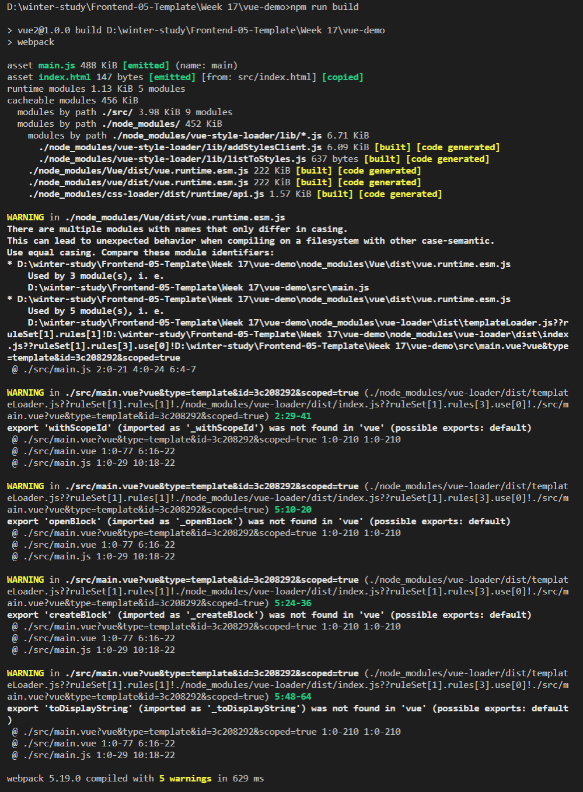
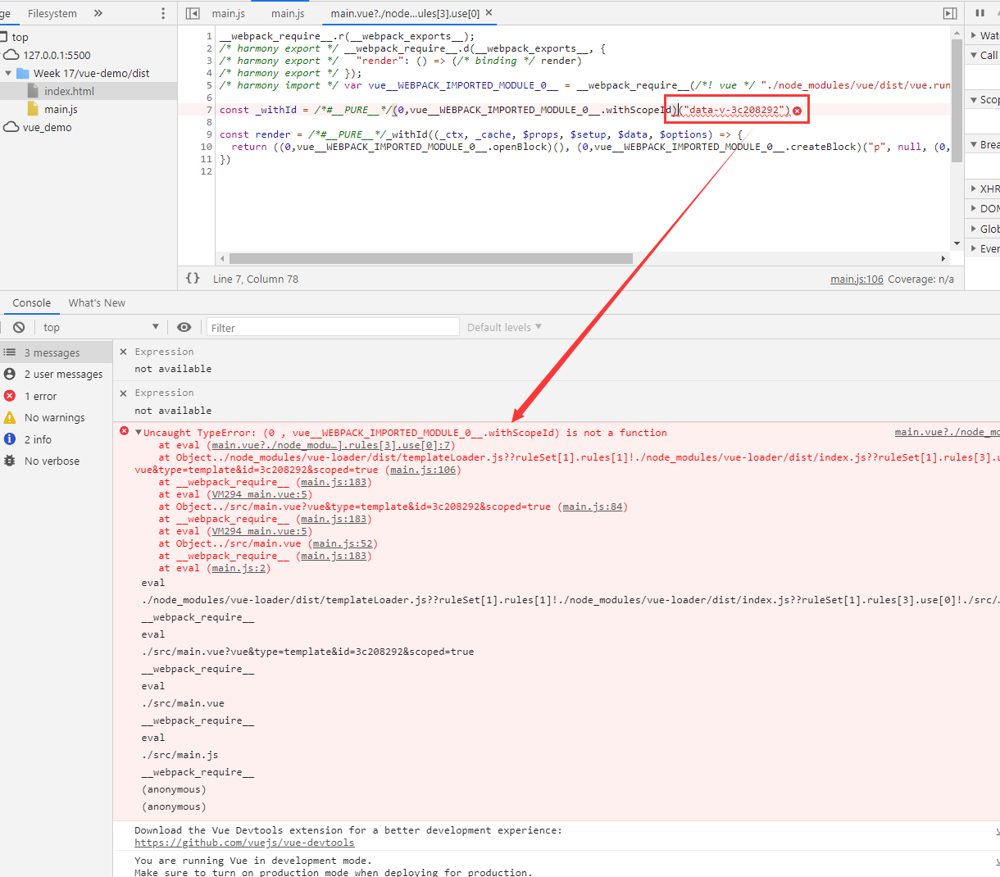

# 工具鏈

## 脚手架

脚手架和工具链不是一回事，一般来说 generator 是指的脚手架

### Yeoman

- 初始化并使用 Yeoman

  Yeoman 是生成脚手架的构建工具

  1. 新建文件夹

  ```bash
  mkdir ToolChain && cd ToolChain && npm init
  ```

  2. 安装 yeoman, 全局安装 yo

  ```cmd
  npm i -g yo && npm i yeoman-generator
  ```

  3. 配置文件目录

  ```cmd
  mkdir generators && cd generators && mkdir app && cd app && echo > index.js
  ```

  4. 使用 yeoman

  index.js

  ```js
  var Generator = require("yeoman-generator");

  module.exports = class extends (
    Generator
  ) {
    // The name `constructor` is important here
    constructor(args, opts) {
      // Calling the super constructor is important so our generator is correctly set up
      super(args, opts);

      // Next, add your custom code
      this.option("babel"); // This method adds support for a `--babel` flag
    }
    method1() {
      this.log("method 1 just ran");
    }

    method2() {
      this.log("method 2 just ran");
    }
  };
  ```

  package.json

  ```JSON
  {
    "name": "generator-toolchain",
    "version": "1.0.0",
    "description": "",
    "main": "generator/app/index.js",
    "scripts": {
      "test": "echo \"Error: no test specified\" && exit 1"
    },
    "author": "",
    "license": "ISC",
    "dependencies": {
      "yeoman-generator": "^4.12.0"
    }
  }

  ```

  5. npm link

  在根目录下`npm link`

  6. yo toolchain

  在根目录下`yo toolchain`

- yeoman 文件模板系统

  1. 在`generators/app/`目录下新建`templates/index.html`

  ```html
  <html>
    <head>
      <title><%= title %></title>
    </head>
  </html>
  ```

  2. 使用`copyTpl`动态插入内容生成目标文件

  ```js
  var Generator = require("yeoman-generator");

  module.exports = class extends (
    Generator
  ) {
    // The name `constructor` is important here
    constructor(args, opts) {
      // Calling the super constructor is important so our generator is correctly set up
      super(args, opts);

      // Next, add your custom code
      this.option("babel"); // This method adds support for a `--babel` flag
    }
    method1() {
      this.log("method 1 just ran");
    }

    method2() {
      this.log("method 2 just ran");
    }

    async step1() {
      this.fs.copyTpl(
        this.templatePath("index.html"),
        this.destinationPath("public/index.html"),
        { title: "Templating with Yeoman what fuck XXX" }
      );
    }
  };
  ```

  3. 可以根据 prompting 的来动态生成目标文件的模板

  ejs 模板的 if, else, include 的用法

  ```js
  // include
  <%- include xxx.ejs %>
  <%- include xxx.html %>

  // if ... else ...
  <% if (xxx) { %>
  <%= xxx变量 %>
  <% } else { %>
  <%= xxx变量2 %>
  <% } %>

  ```

  - yeoman 依赖系统

  可以配置`extendJSON`和`destinationPath`还有`npmInstall`组合生成 package.json 并安装相关依赖

  ```js
  var Generator = require('yeoman-generator')

  module.exports = class extends Generator {
      // The name `constructor` is important here
    constructor(args, opts) {
      // Calling the super constructor is important so our generator is correctly set up
      super(args, opts)

      // Next, add your custom code
      this.option('babel') // This method adds support for a `--babel` flag
    }
    ...

    initPackages () {
      const pkgJson = {
        devDependencies: {
          eslint: '^3.15.0'
        },
        dependencies: {
          react: '^16.2.0'
        }
      };

      // Extend or create package.json file in destination path
      this.fs.extendJSON(this.destinationPath('package.json'), pkgJson);
      this.npmInstall();
    }
    ...
  }

  ```

- 使用 yeoman 而非 vue-cli 构建可以跑 vue 代码的环境

```es6
// index.js
var Generator = require("yeoman-generator");

module.exports = class extends (
  Generator
) {
  // The name `constructor` is important here
  constructor(args, opts) {
    // Calling the super constructor is important so our generator is correctly set up
    super(args, opts);

    // Next, add your custom code
    this.option("babel"); // This method adds support for a `--babel` flag
  }

  async initPackages() {
    let answers = await this.prompt([
      {
        type: "input",
        name: "name",
        message: "Your project title",
        default: this.appname,
      },
      {
        type: "input",
        name: "author",
        message: "Your project author",
      },
    ]);

    const pkgJson = {
      name: answers.name,
      version: "1.0.0",
      description: "",
      main: "generator/app/index.js",
      scripts: {
        test: 'echo "Error: no test specified" && exit 1',
        dev: "webpack",
      },
      author: answers.author,
      license: "ISC",
      devDependencies: {},
      dependencies: {},
    };

    // Extend or create package.json file in destination path
    this.fs.extendJSON(this.destinationPath("package.json"), pkgJson);
    this.npmInstall(["vue", "@vue/compiler-sfc"], { "save-dev": false });
    this.npmInstall(
      [
        "webpack",
        "vue-loader@15",
        "vue-style-loader",
        "css-loader",
        "vue-template-compiler",
        "copy-webpack-plugin",
      ],
      { "save-dev": true }
    );

    this.fs.copyTpl(
      this.templatePath("index.vue"),
      this.destinationPath("src/main.vue")
    );

    this.fs.copyTpl(
      this.templatePath("webpack.config.js"),
      this.destinationPath("webpack.config.js")
    );

    this.fs.copyTpl(
      this.templatePath("main.js"),
      this.destinationPath("src/main.js")
    );

    this.fs.copyTpl(
      this.templatePath("index.html"),
      this.destinationPath("src/index.html"),
      {
        title: answers.name,
      }
    );
  }
};
```

> 正常配置的 webpack 打包后会报错，没有找到答案

1. webpack 打包报错



2. 浏览器报错`main.vue?./node_modules/vue-loader/dist/templateLoader.js??ruleSet[1].rules[1]!./node_modules/vue-loader/dist/index.js??ruleSet[1].rules[3].use[0]:7 Uncaught TypeError: (0 , vue__WEBPACK_IMPORTED_MODULE_0__.withScopeId) is not a function`



原因分析: 根据打包的警告提示，没有在 vue 中找到 withScopeId 这个方法

解决方案:

1. 把 vue-loader 降级到 15.0.1 版本
2. 然后会报错`Error: Cannot find module 'webpack/lib/RuleSet`
   原因: webpack.config.js 中`const VueLoaderPlugin = require('vue-loader')`要改为`const VueLoaderPlugin = require('vue-loader/lib/plugin')`
3. 浏览器会报错`Uncaught SyntaxError: Cannot use import statement outside a module`
4. 确认没有问题，重新跑流程打包成功后，浏览器有报错信息`[Vue warn]: Cannot find element: #app`
5. 原因是 js 文件放在 head 标签的里面，导致文件未加载完成就运行 js 文件，所以 js 找不到 #app，把 script 标签移出 head 标签，放到尾部

## Webpack

最初是为 Node 而设计的一个打包工具，能力是把 Node 的代码打包成一个浏览器可用的 js 包
它的核心设计理念就是最后打包出一个 js 文件，在 html 里面来引用 js 文件
安装 webpack 需要 webpack-cli webpack 两个依赖
如果想只在项目内本地安装 webpack 推荐使用 npx webpack

### webpack 的 loader 是灵魂

从本质上来说 loader 只是做了文本转换，最后使用`import`语句或者是`require`函数，把文件加载进来，通过 rules 里面的 test 正则筛选匹配的文件使用对应的 loader， 也有多个 loader 处理同一个文件的情况

loader 是 webpack 的核心机制，plugin 相比于 loader 更像是一个独立的机制

### Babel - 一个独立的转换工具

作用是把新版本的 JS 转换成老版本的 JS 的一个工具

项目目录下放置一个`.babelrc`文件

```
{
  "presets": ["@babel/preset-env"]
}
```

更多的时候我们用的是 babel-loader，在 webpack 打包过程中使用它对每个文件处理成低版本的 JS
一般来说使用 preset 和一些 plugin 来完成工作
